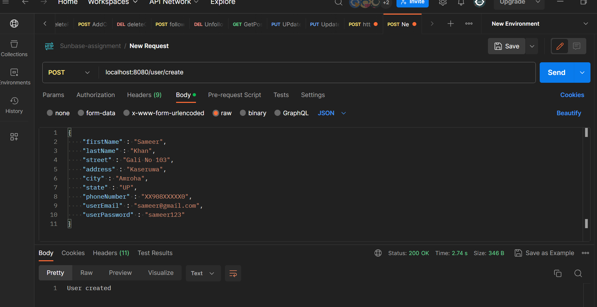
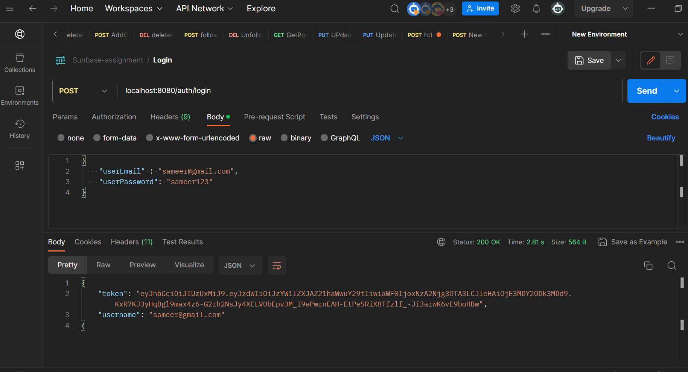
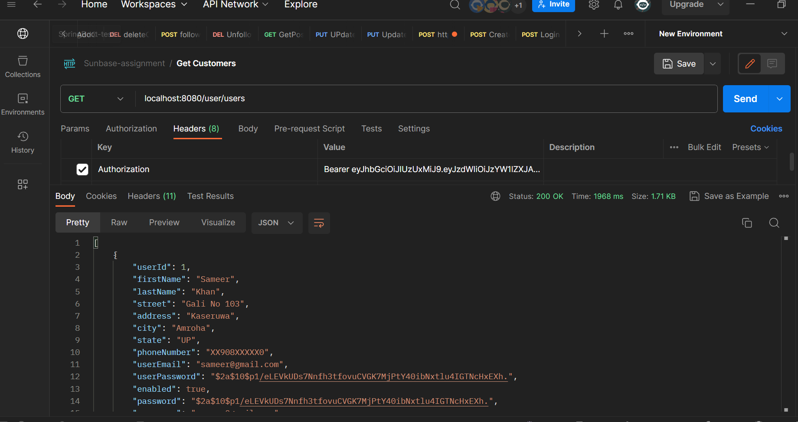
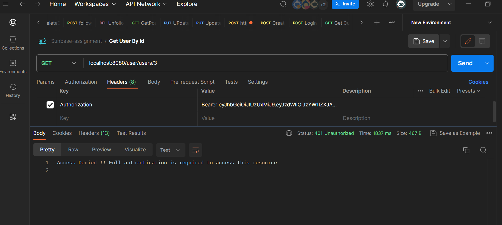
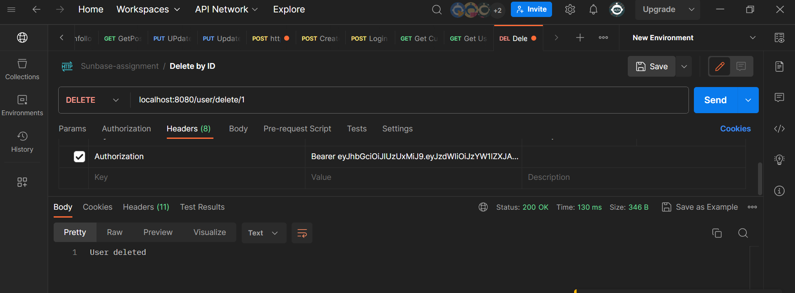

## **Welcome to README-FILE[Documentation]👋**
___
___

# Customer Management API[**(Basic Design with JWT Authentication)**](#heading-ids)

# Sunbase-Assignment

Hi! This is a Project for Sunbase company.

This project helps user to perform basic CRUD operations on their profiles and also shows the implementation of JWT for authentication and authorization purpose.


____
## 🚀 About Me
*Hi, My name is Moh Sameer Khan*,

I'm a full stack developer apprentice at Geekster. I have knowledge of Java, OOPs, Maven, APIs, DSA, SpringBoot, MySQL, GIT.

## Table of Contents
1. [Introduction](#introduction)
2. [Technologies & Framework Used](#technologies-used)
3. [Features](#features)
4. [Guide for Output](#features)
4. [Prerequisites](#features)
5. [Installation](#installation)
6. [Usage](#usage)
7. [API Endpoints](#api-endpoints)
8. [Data Structures](#database-schema)
9. [Security](#security)
10. [Project Summary](#project-summary)
11. [Contributing](#contributing)
12. [License](#Licesne)

> ## Introduction 
*Cutomer Management System API is a backend project that aims to provide a robust and scalable platform for users to create and manage Tasks, update on tasks, delte the tasks, and authorize user and Adming can control all Task Management System. The platform is designed to offer a seamless user experience and allow tasks to showcase their writing skills and engage with a wider audience.*

-  ## [**Framework and Technologies Used :**](#heading-ids) ##
___
- Java Spring Boot: For building the backend server and managing RESTful endpoints.

- MySQL: As the relational database management system to store user and blog-related data.

- Hibernate: For object-relational mapping between Java entities and the MySQL database.


- Swagger: For API documentation and testing.

- Maven: As the build tool to manage dependencies and run tasks.
- ### Framework : **SpringBoot**
- ### Technologies : **Java, MySQL**
- ### Others : **Java Persistence API (JPA), Swagger UI, Email**


> ## Features

- User Registration and Authentication: Users can sign up, log in, and log out securely using email and password credentials.
- Admin Registration and Authentication: Admin can sign up, log in, and log out securely using email and password credentials 
and Admin can also control all activity of any user.
- Create and Manage Tasks: Authenticated users can create new Tasks, edit their existing task, and delete their tasks.

- Pagination: Tasks are paginated to enhance the user experience.

- User-Friendly API: The project provides a well-documented and user-friendly API for easy integration with front-end applications.

_____
## Guide

- This is the way to create a user, you just need to pass the JSON.
  


- This is how you can login, and it will give you the JWT token
  


- This is how you can get list of users, but first you need to pass your token as bearer in the request.
  


- This is what happens when you pass wrong bearer, it shows error message
  


- This is how you can delete a user, by passing its ID in path variable and your token in request.
  



-  ## [**Prerequisites :**](#heading-ids) ##
*To run this project, ensure that you have the following installed:*
> - Java Development Kit (JDK)
>- MySQL
>- Maven

-  ## [**Installation :**](#heading-ids) ##

1. Clone the repository from [GitHub link](https://github.com/Moh-Sameer-Khan/Task-Management-API.git).
2. Install Java JDK and Maven on your machine.
3. Set up a MySQL database and configure the database connection in the application.properties file.
4. Run the Maven build to compile the project.
5. Start the application using the command.

## [Usage](#heading-ids) ##

1. After starting the application, access the API documentation at [http://localhost:8080/swagger-ui.html](http://43.204.236.74:8080/swagger-ui/index.html#/) for information on available endpoints and how to interact with the API.

2. Use tools like Postman or any API client to test the various API endpoints.


# Classes and Instructions

This section contains information about the project and how to perform operations in the application.


## Controller Section

-   *This section contains a User Controller and a Auth Controller* :

* ### User Controller
    - This class contains various API endpoints that helps user to interact with the application resources. Some of the examples are :

    * @PostMapping("user/create")
    * @PutMapping("user/update-profile")
    * @GetMapping("user/users")
    * @GetMapping("user/user/{UserId}")
    * @DeleteMapping("/delete/{Id}")

* ### Auth Controller
    - This section is used to authenticate user and provide him a **JWT token**. This helps in securing our application so that only validated users are allowed to access it.

## Service Section

- *This section contains various classes each of which contains methods for buisness logics of the APIs*

* ### User Service Class

    * This class implements the logic of how user date is processed with application, like save, update and delete.

## Model Section

- *This section contains various models and a DTO which are used as tables to store data in our database.*

## Repository Section

- *This section contains Repository for our user model.*


## Security Section

- This section helps us implement and configure Spring Security according to our needs. This helps in securing our app and provided authentication service to the application. Some examples of the classes implemented in this section are :

* #### JwtAuthenticationEntry Point
* #### JwtAuthenticationFilter
* #### JwtHelper


## Database Design
- *Here we have used Relational Data to store data.*

- *We have used MYSQL and the database is hosted on a local server.*


## [**Data Structure used in my Project**](#heading-ids) ##
____
> - **[Used :-](#heading-ids)** *SQL Database --> But Mostly used Java Concept, oops, collection, ENUM*


## [**Encryption**](#heading-ids) ##
____
*Authentication is implemented using an Authentication Token class. This token is generated upon successful sign-in and must be included in the headers of subsequent requests to authorized endpoints.*


## [**Project Summary**](#heading-ids) ##
____
> - **[Aim :-](#heading-ids)** *This is basically good project for learning purpose springBoot basics, Mappings, Annotation, API, spring mvc and CRUD Operation, swagger, crud Repository inbuilt method, and Custom Finder and Custom Query. In this project i just add Posts, get all psots a particular user,  update User inforamtion lot of things i learned from this project.*

## **[👨‍💻 Sameer](#heading-ids)** ##
____

- Twitter: [@Sameer.twitter](https://twitter.com/Sameerr1819)

- Github: [@Sameer-Github](https://github.com/Moh-Sameer-Khan)


🤝 **Contributing**
___
Contributions, Thanks to everyone , contributing with me and know about more myself [visit my profile](https://www.instagram.com/sameer181911/).

**Show Your Support**
___
Give a ⭐if this project helped you!

- ```bash
  BECOME A SOFTWARE DEVELOPER 👩‍💻

<!-- Here something icon -->

📝 **License**
___
Copyright © 2023 [Moh Sameer Khan](#heading-ids).

This project is [Customer Management System](https://choosealicense.com/licenses/mit/) licensed.

___
*This README was generated with* 🧡 *by [readme-md-generator](https://www.makeareadme.com/)*


